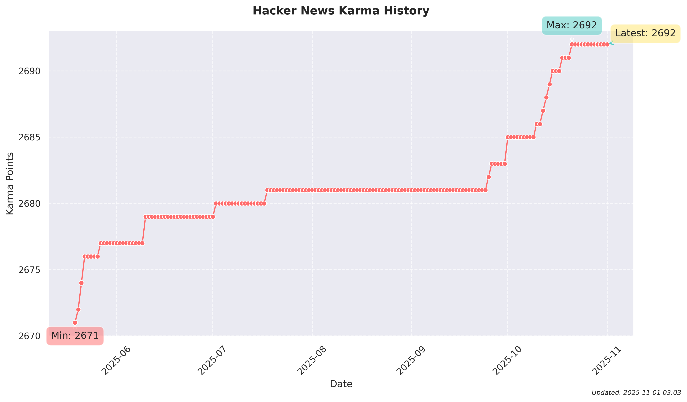

# Hacker News Karma Tracker

This repository automatically tracks the karma points for a Hacker News user and generates a visualization of the karma history.

## Latest Karma Plot


## Features
- Daily automatic karma tracking
- Historical data storage in JSON format
- Visual representation with trend analysis
- Automated updates via GitHub Actions

## Setup
1. Fork this repository
2. Set up the `HN_USER_ID` secret in your repository settings
3. Enable GitHub Actions

## Local Development
```bash
# Install dependencies
pip install -r requirements.txt

# Run karma tracker
python src/karma_tracker.py

# Generate plot
python src/plot_generator.py
```

## Data
- Karma history is stored in `data/karma_history.json`
- Plots are saved in `images/karma_plot.png`

## License
Apache 2.0